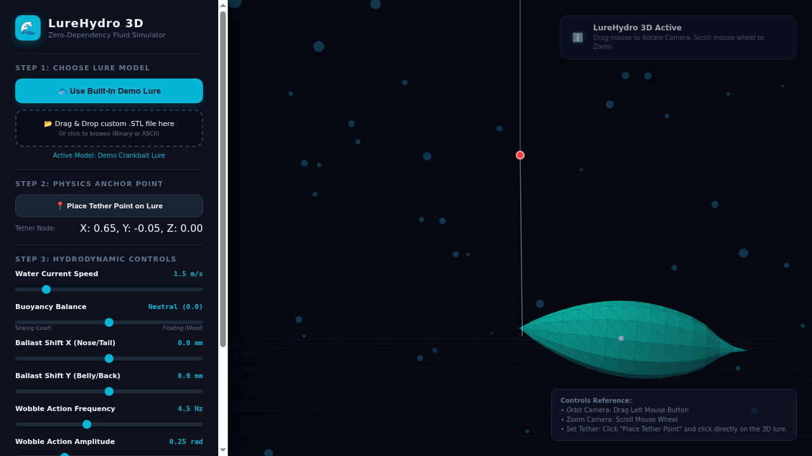

# 🧊 3D Printer Agentic Studio

[](https://www.python.org/downloads/)
[](https://fastapi.tiangolo.com/)
[](https://trimesh.org/)
[](https://threejs.org/)

An AI-powered parametric 3D CAD application that converts text descriptions into executable 3D geometry code (Python and OpenSCAD). It supports rendering interactive 3D WebGL models in-browser, exporting watertight binary `.stl` files for 3D printing, and hosts specialized simulators such as a Lure Hydrodynamics Simulator.

The repository accommodates various generated models based on OpenSCAD, Python, and other generation scripts.

---

## 🖼️ Generated Models Gallery

Here is a visual gallery of 3D models generated by this project. You can find their source scripts and playground links by clicking on their names below.

| Model Name | Thumbnail |
| :--- | :--- |
| [Coffee Filter Mold](generated_models/openscad/coffee_filter_mold) |  |
| [Door Jamb Hanger](generated_models/openscad/door_hanger) |  |
| [Fishing Hoochie Wiggler](generated_models/openscad/fishing_hoochie_wiggler) |  |
| [Fishing Scent Holder](generated_models/openscad/fishing_scent_holder) |  |
| [Diamond Fishing Spoon](generated_models/openscad/fishing_spoon) |  |
| [Gas Can Cap](generated_models/openscad/gas_can_cap) |  |
| [Hexagonal Table Organizer](generated_models/openscad/hexagonal_table_organizer) |  |
| [Circular Leitner Box](generated_models/openscad/leitner_box) |  |
| [Square Lipstick Organizer](generated_models/openscad/lipstick_organizer) |  |
| [Rugged Enclosure](generated_models/openscad/rugged_enclosure) |  |
| [Salmon Fishing Spoon](generated_models/openscad/salmon_fishing_spoon) |  |
| [Siding Light Mount](generated_models/openscad/siding_light_mount) |  |
| [Window Exhaust Adapter](generated_models/openscad/window_exhaust_adapter) |  |

---

## 🌊 Lure Hydrodynamics Simulator

Even though this is not directly related to the core AI capabilities of the project, one of the main hobbies that inspired this tool is creating fishing lures. This built-in simulator lets you see how a lure floats, moves, and wiggles in water to test out various designs. 

You can try it out directly in your browser by loading an STL file and playing around with the physics!
[👉 Launch the Lure Simulator Here](https://htmlpreview.github.io/?https://raw.githubusercontent.com/SinaChavoshi/3d_printer_agentic_models/refs/heads/main/tools/simulators/lure_hydrodynamics_simulator/index.html)



---

## 🌟 Key Features

* **AI-Driven Parametric CAD:** Uses Vertex AI Gemini to generate valid Python `trimesh` and OpenSCAD code.
* **Auto-Correction Reflection Loop:** Automatically catches Python runtime/geometry errors and sends traceback back to Gemini to self-correct and re-execute code.
* **Multi-Language Generation:** Stores and executes models generated via Python and OpenSCAD scripts.
* **Model Simulators:** Includes a Lure Hydrodynamics Simulator to observe how a generated lure model behaves under water current.
* **Watertight CSG Boolean Engine:** Integrated `manifold3d` CSG engine for reliable boolean subtractions (`difference`), unions, and intersections.
* **Interactive 3D Web Visualizer:** Built with Three.js, OrbitControls, grid floor, lighting, and wireframe toggle.
* **3D Print Analyzer:** Displays bounding box dimensions (mm), estimated volume (mm³), triangle face count, and watertight status verification.
* **Instant STL Download:** One-click binary `.stl` file download ready for 3D printing.

---

## 🏗️ Project Architecture

```
3d-printer-agentic-models/
├── app/                  # Main 3D generator AI app
│   ├── __init__.py
│   ├── cad_agent.py      # Vertex AI Gemini LLM CAD Agent & Reflection Loop
│   ├── mesh_engine.py    # Python 3D execution engine & manifold3d CSG ops
│   └── server.py         # FastAPI Web Server (/api/generate, /api/export/stl)
├── simulators/           # Simulation tools
│   └── lure_hydrodynamics_simulator/  # Lure hydrodynamics testing
├── generated_models/     # Generator scripts (binary STLs are gitignored)
│   ├── python/           # Python (.py) scripts for models
│   └── openscad/         # OpenSCAD (.scad) scripts for models
├── static/
│   └── index.html        # Three.js 3D Visualizer & Studio Web UI
├── tests/
│   └── test_mesh_engine.py  # Unit & Integration Test Suite
├── PRD.md                # Formal Product Requirement Document
├── Dockerfile            # Production Container Image
└── pyproject.toml        # Dependencies
```

---

## 🚀 Getting Started

### Prerequisites
* Python 3.11 or higher
* [`uv`](https://docs.astral.sh/uv/) package manager (recommended) or `pip`
* Google Cloud ADC credentials (for Vertex AI Gemini access)

### 1. Installation
Clone the repository and install dependencies:

```bash
git clone https://github.com/SinaChavoshi/3d_printer_agentic_models.git
cd 3d_printer_agentic_models
uv sync
```

### 2. Running the Server Locally
Start the FastAPI application:

```bash
uv run uvicorn app.server:app --host 0.0.0.0 --port 8088
```

Open your browser to **`http://localhost:8088`** to access the 3D Agent Studio.

---

## 🧪 Running Tests

Run the test suite using `pytest`:

```bash
uv run pytest tests/test_mesh_engine.py
```

---

## 📖 Sample Prompts to Try

1. **Mechanical Gear:**
   `Create a 3D printable mechanical gear with 12 teeth and a square mounting hole.`
2. **Hollow Pen Holder:**
   `Generate a 3D printable hexagonal pen holder container 100mm tall with 4mm thick walls.`
3. **Twisted Vase:**
   `Generate a 3D printable twisted spiral vase with a flared top rim.`

---

## 📄 License

This application is free to use for personal applications, but not for commercial use. You may share and modify it with attribution.

These terms align with standard 3D printing community licenses (e.g., Printables):
*   ✖ **Sharing without ATTRIBUTION** (Attribution is required)
*   ✔ **Remix Culture allowed** (You can modify and edit the code/models)
*   ✖ **Commercial Use** (Free for personal applications only)
*   ✔ **Free Cultural Works**
*   ✔ **Meets Open Definition**
