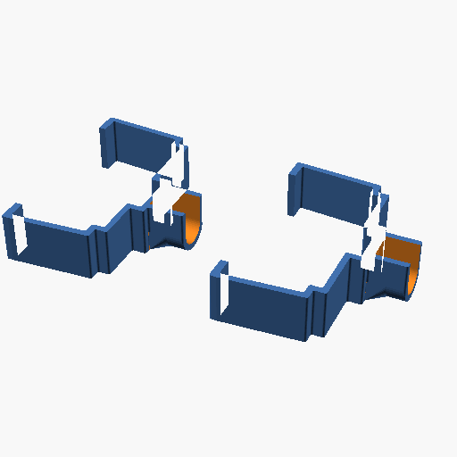
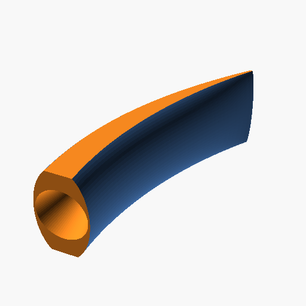
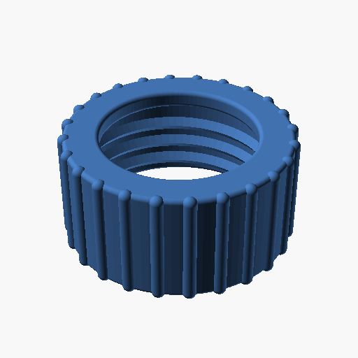
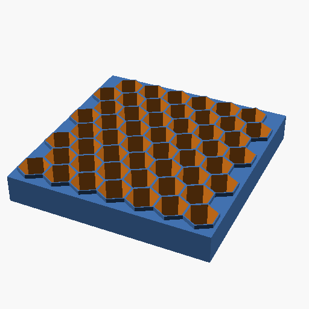
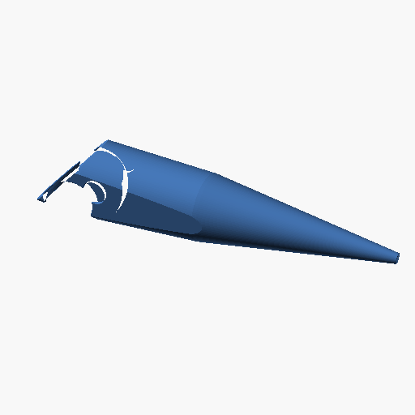
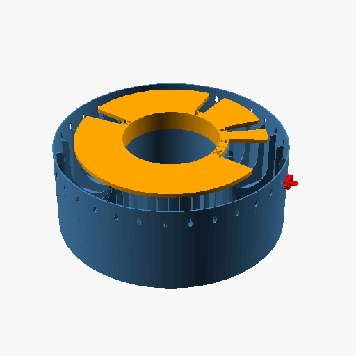
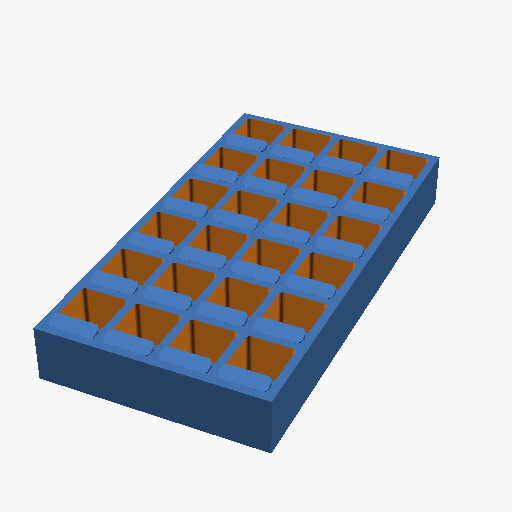
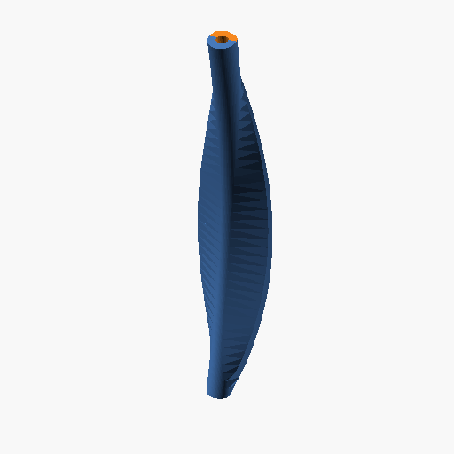

# Generated Models

This directory contains the source scripts for the various 3D models generated and managed by this project.

## Organization
- `python/`: 3D models generated programmatically via Python (`.py` files).
- `openscad/`: 3D models generated via OpenSCAD scripts (`.scad` files).

## ⚠️ Important Note on Binary Files
To keep the Git repository small and fast to clone, **binary 3D files (like `.stl`, `.obj`, etc.) are ignored by version control** via `.gitignore`. 

You should commit the lightweight *scripts* (`.py` and `.scad`) that generate the models here. When you or another user clones the repository, you can re-run the scripts to generate the final 3D meshes locally.

## OpenSCAD Models Gallery

| Model Name | Thumbnail |
| :--- | :--- |
| [Coffee Filter Mold](openscad/coffee_filter_mold) |  |
| [Door Jamb Hanger](openscad/door_hanger) |  |
| [Fishing Hoochie Wiggler](openscad/fishing_hoochie_wiggler) |  |
| [Fishing Scent Holder](openscad/fishing_scent_holder) |  |
| [Diamond Fishing Spoon](openscad/fishing_spoon) |  |
| [Gas Can Cap](openscad/gas_can_cap) |  |
| [Hexagonal Table Organizer](openscad/hexagonal_table_organizer) |  |
| [AI-Optimized King Salmon Cut-Plug Lure](openscad/king_salmon_cut_plug) |  |
| [Circular Leitner Box](openscad/leitner_box) |  |
| [Square Lipstick Organizer](openscad/lipstick_organizer) |  |
| [Rugged Enclosure](openscad/rugged_enclosure) |  |
| [Salmon Fishing Spoon](openscad/salmon_fishing_spoon) |  |
| [Siding Light Mount](openscad/siding_light_mount) |  |
| [Window Exhaust Adapter](openscad/window_exhaust_adapter) |  |
