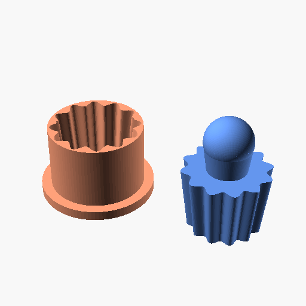

# Coffee Filter Mold / Pod Maker



## Description
This is a parametric 3D model of a mold designed to press flat filter paper into a fluted, star-shaped cup that fits inside a reusable stainless steel coffee pod (such as a K-Cup).

The mold consists of two parts:
1. **The Receiver (Light Salmon):** A female base with a 12-flute star pattern inside.
2. **The Ram (Cornflower Blue):** A male press with a matching 12-flute star pattern on the outside, and a handle on top for pressing down the filter.

## Features
- **Fully Parametric:** Easily adjust the top and bottom diameter, pod depth, and the number of flutes (pleats).
- **Tolerance Variables:** Adjust `paper_thickness` and `fit_tolerance` to ensure the ram presses the paper into the receiver perfectly without jamming.
- **Fluted Design:** 12-point star pattern ensures the paper filter collapses evenly into the cup shape, increasing surface area for better extraction.

## Printing Instructions
Open the `.scad` script. Near the bottom, you will find:
```openscad
translate([-35, 0, 0]) receiver();
translate([35, 0, 0])  ram();
```
To print the components separately, simply comment out one of the lines using `//` and render (`F6`), then export to STL (`F7`).

## Try it out
To modify the model or print an STL/3MF file, you can view this live in the OpenSCAD playground by following this link:
[OpenSCAD Playground](https://ochafik.com/openscad2/#H4sIAAAAAAAACq1YbW/bOBL+KwNee3AaOX6Lt10FRq9N+oZrDr2kbRaIcwYtjSw2FEdHUkmcbPa3H4ayZTntZQvc+ZPNGT7z+gxJ34lSWlk4Ed8JmXh1hZ+kz0UselrNrbQKXY9KNC6RaQ9vZFFqdL3X0qnE9Q5P33ULSiuNbo8VRCQylL6y6ER8LrS8XXYro8iIi0hcSRus+Gvl/EyahUYR748j4TyWM6duUcTDSDzJjIgH/X4krlXq85khhyIesJ4mPwuLIh7uvVgr5ChTEQ9HkcAlzlIlC/RoRfwiEhZNinY2tzK5RC/iQbOUE6UiXhsR8WDUj0SKZfg+fBGJHNUi5y37/UjMpcOZI63S2Xr9RSToCq2W5Wy9bRwJNOkMbzwax0HHw3EkPGm00iQo4v7eMBLXOaLedtOVdImznDSu0jBaq628G0fCVMUc7YyyWdB2YdFLu0A/8xZlOnOlTJRZiHg/EiWlM09ly8z+sF6dk/dUtASjcS1YRTEa3kfCUWWTUMM7Uf5P7ZCQ8Wg8A/Sg2+3CJ+42tuz459RMTa8HR6qoU+aAMlhSZeHUS2U0OgenHlHDJ0qh88EYtC3tnal5GClMYH94AADQ68FnKoG9VWYBjcLaQsmIzkuTSpvC37tJVcIf4353PCiKFfCDZMEERuMDBn4dBD+JORp1R88bzJBnRqq9XH04CUFAGfgcGWiVm7e68gidUy8tfJLeozU7cEgmU4vKSq/ITI2pilnGeg4mMGgD93rwj9A5DDwVzks7FVCSMt71So3SO+gMht3BL6AcVK6SWi9hQZRCRhYypblUOzA1Ab/xfrA3PmjZeE/XkCKWwXer0gU6kBahww2ifJXiOrBreYU7q9A+r6nh4K9wLD1aJfXUlLJEO/O5Si4NN8AE+nujdUlflaWlG9hIKYOEsgxx5SyE7VOTKT9ruBcw9g8af9/ceCthIcsQ5egISquMh0SjrPU7yiQWpUNQWS10kCkPngg8T4B1DMekUzj1tkp8ZaWGU/RemYWbmoJ0OruWWnOx27UOndn2n/PC2sDabmrCuKkHDUxgfPD4TosJqiu0wNug1NLj1OTSpLoFMmhQuFr16mp/rQpkajRZrCI7LYh83raUVPYKHXRytcgDG1xQYdOVB6fpGi3UA3Znap5khg33+wcrQKb/odRJxS6m8FXqCldToNfbSMDKVKmpYVazke8Y3oPhwdTMyTfihzytNeoeyzHU2SCmDjyBTBKqjA+FD60Cu5u6s1Uv9Yx3TOBhI+7CVlMFE01kx1IZOAnBw0daqKSJ7IvpJlQUaHxNbWk9Twu4lrxC4BB7eFOS9QznrTSO89A5747GEfQj6F/sNFXu7Bxs6bRUuHZBvPGpHsbrSVvP5loN7qaG2yEhTbYzFYdkTRYq+FpXOBVMeZaH43uj3jQhQmnROZ6sGdkCOsdSM7FbSmcIrpp7K5M68EA3S0X4kW5Gvico5CWC8oFiyjiV4gaJZTOXyxI7m0X+5Kvqh5kUwbbQcs/ABOou6kJT1+8V58QMqfvpEcVmwG6m7UMVWbDJ1qTciLku6+9bWXof6LdZatW2H0rbhHjRSm+y1IpbrZNPtqgegR1MBv0I7HAyGP6J0XA+HsoSOpYqkyqz2PkZP2AXtmy2/XJljhY7tmX8fmru293XNPLDFvzIYKdSF2Q2/ZeqLEOLJsHvmvDNDZ8YZCHczGCuKbnsJVW5UfpB824nr91BsAutwRuBbbpnF5pZ3s7odlZXTp2pdD2KecI4L+dKK798xIM/twq7MG5bDvlsGf1gVplIKk+Vh85bLH5ER60yzzSrSpgv23bBEa/n0oGETBPZRxqhta9d+p/jKezCIGJ3dgdMfDSusoH6SeUd+NxStcg5A4/Q+VEK/z9oC7vQ3xuyl6eaw9TLcLtBu0Yjszl2PfEovOLxPleBRSA9eFW679m/5sJqPr9DKtDbJbxHzej1vN4ciRYlW5OgKeMjk69vveBC2rRQQ6xW/vOoTlhUpyaCddyyKBs2aGVQWn6u2CrFTnNVyCMITzS+M0XgEqn5+lQXoLcGdFolIavj/ha92MNZaSlTGjs27Gs5sM5y7QlMgj/fp2YdN58Tw6OACSvMJtptQz+OsNeDd2jQ8qWivvIGTjJswAzJqlVX4gmcb2Jh3Y7itT7EMPqFz9jtxtHooRNesjABtfMDId9lKjejLHPo64DhGSTkOquMPIOwf+fB5nPo8ATY2r6z2llviP6LhlNmpQEXNebFwTpGvVyQ6dSxct7vxf1FJOq7x1uyhfTDIxELd7UQ28sjXh4VWVgO/WIPeWrzE/HiPhJXCq/5ba9p4UScSe0wElouqfK8XFCKIhZFpb3i/wgoqTZqmCpPVsTeVlgjYfMrqZynQt2uV+75Ram1LB2mh43ss5wHR4KQocRfsl/T58NERMLldP3qht+yNSJ3ff0iWntwHwnm7yqCua5sLh0/eX9/c/pE0792uwd7v95UL+fHv7+cn716+vHs9dlX//zsq1x+O/92Lpd//PtUHT21B8d387l/fvaabi+Pbiq39+ErZS4+e81a+8bkTxe/fb7xEk++EX79Wzc+vjvZ7ZYnz04uKcv+KZd7L+j2+Obry5NvlFEml3T726unH93ehy8u9s/PDhnnw5eTb/7En1DGuPTx7JW4v/8PIZ4vNcQRAAA=)

## License
This model is free to use, modify, and edit for personal applications with attribution.

*   ✖ **Sharing without ATTRIBUTION** (Attribution is required)
*   ✔ **Remix Culture allowed** (You can modify and edit the models)
*   ✖ **Commercial Use** (Free for personal applications only)
*   ✔ **Free Cultural Works**
*   ✔ **Meets Open Definition**
