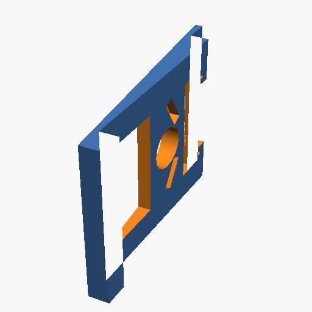

# Siding Light Mount

## Description
This is a parametric 3D model of a mounting block designed to enable mounting a light (or other fixtures) against house siding. It creates a flat vertical surface on angled siding to ensure the light is mounted securely and straight.

## Try it out
To modify the model or print an STL/3MF file, you can view this live in the OpenSCAD playground by following this link:
[OpenSCAD Playground](https://ochafik.com/openscad2/#H4sIAAAAAAAAE+1aa3PaPBb+K2fc7TvQmJtzaZos825C0stMEvoS0swuMB5hy6DUljySHKBt/vuOZBlfoGk6u33bD02+gKVze86jcyThz1aMOIqEdfTZQp4k9/g9knPryGrFIVrNOEuo3xQe8i3bCjCSCcfCOhpZIfq0aiSUMGpNbOseca1hgcLQlXPifaRYCOtoz7ZCJL25uyC+0uo42QM552xhHXUc25oTOsPZjM6+bc1ZiF0WBAJLN+AscpVa6+iguf9gW4Il3NM+fLbir7rqMSoxlWqwBSd0FmIfrolP6AwuWUIl9FgUYyqQZBwa0NfG4ENjyJH3UYzpmLZewOiCzOYSzkiEqSCMigm8aI1pqwVDJlEIc6zHWQByjiHUXwKyVBjBFAkMtSiqj6kecM3kLnQO28cFJTruJ+pI53ah03GOMx/TcE6wkHMsiSfgD+iFGHFEPZw7/JYtIEq8uTKHeUuiMMRcm4y0PBEg54gWnKhFEcSYgyA+ro9pHCKJ3QjxGaHQBad9DFrxbdF9QinmMGdhyBbgJZIl0vjPYkwJneURtA0Ip0xKFoFgIfFhyriv3TIEMsJTPcc1o9q4ATB+XFCyuCJVzKtGTjHiVCUdS6gN5xhOOfFnuL5G7owIqbAExUQd5Wl/OOxfZjFfnFy+B8n0Zw9TiXk2MjVqFZ2zNKIodjXirpmroDg4/iqp0vCizNOpdi6DRX/JiXVgYDkjKMIFP5QljkLwMloUPUrdcPWS8wmCLuwZNReYzvLUonQNCY/jBYiQSQEB44D8u0RINCUhkSujUo26YSrdBcdEVyJKqkbqxQa1veZ+SrYAezJcQUCkAIW6j7gPzw6Bcbjcy5cFC6XQ8Wt8XW0vI9Zec//YMJ6TT4wqSP1SCg3wIaEYFnPMsfbI+HI9PBkMi3EIibh0lQYVi2NY/wFzSbyi6pPT/ofzIgm+S//KlDtFB+P/tc58zug1qTQDcsUZyzRHRJkauXQXDrekgWMPC4H91Dtg6fqfqs8querLHC+BrpcxTaSbChVWssIkXVemwr7nLCAhzqul0pOnY2wJieOxBT6OC5RIZadM5dwApB+5nAisDL08BoC1wvssBXgZMxVDWOLrI+oSqrXtp+pSz29RGOYF4VrRU0DtLfF9TIFQ8BinmAtTFjR9S2tGs848xsg3j18125XHOuIu7OoBiaY5jPvmwXo5O/uVGn+NpfIuL+qXhJIoiTZJktZ0JFPmzVVZFhJiRqiEWlpN62MaEVpiiAIks9hDoZeoku/DBxQmuNr6/HVPzGzunkHMCVUSuleMaVrn1vGU2uAO1Eod5QU49WNotcBx2hBFmXCGTrH9bRcFJdzZd7SwdrSXrkOPMe4TiiQW62r3CbpQNNAC1U+LddldKasb1XoHiqaP84XGYi1RUbEDtXKRbilf11Kmr20RbHxFMK0MIYtxmee6mMRqlRTXTAtyymfCJzfDfqN3fjU8H7y7egMX/TfveqovxR3tR62UtEZBQd2gFKLYMehomZ0tRl4n1JOaHJKBl1GpwFMkAdEV/LuQnTENjBRId9qureoKlhJFd6CmoTGWS97V4QVoDFQ1KmrqPKIpVVQQrfyVNTmPa3Ie16T45SdhlrGUV7U6fB7TdAKkHD4RAkfTMC3uMQtXM0bTpSvWRVmghWRMznWpTiVjV+8WuzBKv6u/UduG9sSu+rLh2nq+Br5df1yqOt+AaBs0NyTL8zsb87frnxwXcYldBbDip6HfP6FI1Dr8WYo7s+Nkdpxv+uV89/ySA3bJn0khDjjadO2JohUIJItVfnVayyLZTEUX13ClCx6jHpK1lBm2wdBOFaXFRMn4JAgwx9TDORkhpeIlIhQWWO03psxf5WNqb4O4i5eSJz6urUt8oabaZh/UDVAocElz5umM0dra2YLr9eN87kP+Mf+kjiT5vr5WrOQNKJ00sqKVSUZo6XqJXPfhQ7152bTQakGj0YC3/YuL/i0Mzt+8619dq0dfmdxpwgVbYA5v07NPPig5okJVv9qo0WnbUD7L7EDe8u1iXJN6GS8vmeLaqOS+DdU20sia+zb1dbsMzaQI80ZATjM7mQ3R9DujKgVifDAmnxBUYQ+0A+1mp+K2CjLfN6neP8m5bJzfbcJNHD8pG4X2/f34V3pl4bTZKIbRqJj5jjTsNfUh90k5eJo3Pz05al2dDt6dvTmH3s2wfzM066o0ab+pt29bTq2EFo5B3wIj209lxcj9VI2SM6mF2ja80t2yisIqJNTHvKaqRQUMX9XY8vHZhn8EtHvQ3oj6oAkDDdv6KK9Of1B7zRmVOiXQyO6pdtvg4xnHWMBNDH9AP5H1p0aqtmObx8o8/vK4Or1+DZFdBccWRAr22zY0thzCW+BsQ3J7BatK21C4Pnh8cbxswgUOHof0knDOuDrhMpgmUmIehKsfAGvjW7BG2hGNWduGzi+Pegnpw4y9VzdDGJz3zq+voXaqrgnM7eAWN6tXED+dqRt3FxqxhjOpqxCvlRkBQp80wxVMccA4hrbec69r0BPArZopQQs7sLcJ7ytD5L8T3b+ZsL8u+Kof9fqDq/MBXPZvrobqVHzdG5zfbutLnbZJldkc9fS1UHpftDVPW3Z8tUITVcf6akcudNCW7qDf6ljVvTU8oW+Vb7DStrV7UC23m8GoXLab7c6kXjZRveOywe9UHiszvvM/2t6vGt4vxbM2tF3nQzWdnayw/V/zWT6QFLPb+J3dH5rd4tdyph2zcNV2+ilZfmw3/XsF/zoreDdbwT8msb+X8s9cyg9j+mCulAeY+uYX6xhxuf41x1yjHlsPE9tSPwVx+ZrxCEnnzDqyxP3MKj/eVY93o0A/1tdXvMdCpl5fGE0ebOue4IV6kyFkM2Ed6csr9crCiiVSPY6Yj60jK0pCSdQbEcxL8mnYJ5Jx60jyBKea8PqblwjJIvIpe/Kg3lEIQxQL7PfWY0M01Y7oQaXKeha88l86nmVbYs4WJ0v15kOqUV3CXSXRFPPMgwfbijnOIpiGCZ8joV6Q+PKfwSp6fdd93l8my3u0eH61vL89lS/R6m6U/gd/3Y3Q6k//Y29Abk8Gd/Lw0v3wr7uRfKnGgvfoC1oFAzX/+ZwFg37wUc1js+CAzeShkkVLtFIz70boy9kztJTXdyN5iFYsYLPbk8xWcBAcBH8FH4P3A4JWbIaWbKbGb09ZYD08/BeYELd7jiIAAA==)

## License
This model is free to use, modify, and edit for personal applications with attribution.

*   ✖ **Sharing without ATTRIBUTION** (Attribution is required)
*   ✔ **Remix Culture allowed** (You can modify and edit the models)
*   ✖ **Commercial Use** (Free for personal applications only)
*   ✔ **Free Cultural Works**
*   ✔ **Meets Open Definition**
