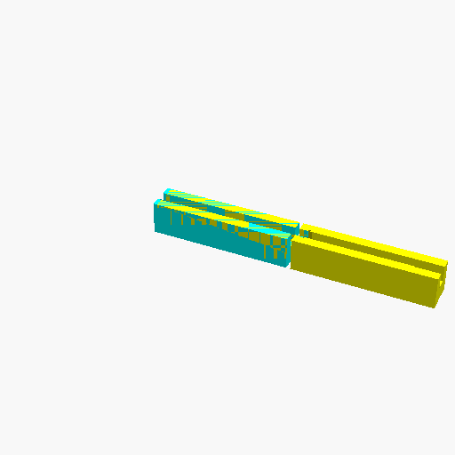

# Window Exhaust Adapter (Dovetail Joint)

## Description
This is a parametric 3D model of a mounting bar, designed to fit into a window track on the bottom and hold an exhaust panel (like for a portable AC) on the top. 

Because the bar is 340mm long—which is larger than most standard 3D printer beds—the model is split into two halves (Left and Right) that connect together seamlessly using a **dovetail joint**.

## Features
- **Top Groove:** 13mm wide, 20mm deep, designed for an exhaust panel.
- **Bottom Groove:** 12mm wide, 2mm deep, designed to slot into a window track.
- **Relief Cuts:** Widens the ends of the grooves to accommodate L-shaped edges.
- **Dovetail Connection:** Splices the 340mm bar into two printable segments with a 0.15mm tolerance for a snug fit.

## Printing Instructions
Change the `print_selection` variable at the top of the script:
- `0`: Preview both pieces connected.
- `1`: Render and export the Left Side (Male dovetail).
- `2`: Render and export the Right Side (Female dovetail).

## Try it out
To modify the model or print an STL/3MF file, you can view this live in the OpenSCAD playground by following this link:
[OpenSCAD Playground](https://ochafik.com/openscad2/#H4sIAAAAAAAAE81Y63PiOBL/V7q0myq42GBMUpM1RWUnmSQ3e3kdyQ27F3IuYTfgRJY8ksxjZtm//Uo2BpuQucztl82HgPrxU7/UavGVJFTSWBHvK6GBjqZ4S/WEeKTJoqGkMkLVFAlyFdCwiXMaJwxV84SqKFDN07sLOxZhylA1jACxyAipTiUq4j0QRr8s7JRHgpNHi0ypzHbRs0hpn/IxQ+IdHFpEaUx8FX1B4rkW+XHEiddyHIvMolBPfC4UEq9l5JjQfkYknts4KgQmSEPiuW2L4AL9MKIxapTEO7KIRB6i9IeSBs+oiddakyZChMQrNiFeq+1YJMQk++4eWWSC0XhiVA4ciwypQl8JFoV+QT+yiJiiZDTxC7VDiyAPfZxr5Mo47bmHFtGCoaQ8QOI5Ddciswkiq5qpEvGM/kQwXIWhXYitrDu0CE/jIUpfjPxMWmVETeUYta8l0tBXCQ0iPibewdIiSqQyyLLwlSR/KqGB4Bq5NgBNsG0bbmXENdwhw0BHghvagDeb4EAXPkU4gxOhJ1C7lTg1K8HZop4JtKALlzjScBeFCLUryjBnuNCFngnrinOOcc5LzFa+Wm/VBacz4JmOseRDFOeRVlCLOMRxPTdGC02Zz5CP9QS60D5wOlBQ8/xBFw4MVE7LogxG8l0BfyGFmKIa8KHQWsT+OFuvJLvQcg1ilZeVAXTBzTC0SF4otTsV+lqh4lQPWYQjqPWjEHnEx6AnCHcs0vV1pO8nkYKZ4auMm+MB1dlqinIByEMFWsAoyomXtprQBAdcZvCl4DgdyP6aTfi7mMGISoi4FpnWkMrs0+wlQa2yMBYmMCugzAx/uDD+dUo4cRpMVnpaQEyfMUNSLNJQc+O4vkYQ3NcigS5omWInR3ifJGwBKyvuRbLKB9TO5hOaKg23lCOrH5dB8mxAF0aUKey8gDnJ+QVSP+KhmMG96Q0GKIvsBzFFTSMG98WpHfAnYYpwfYxNETZah+WUXdGIw6UYR0GeogHPzxCMUsb8IZW1OnwdcBOdMBqNUCIPcENbRa3VyIFOmAieNxwtKVeMaqw92OXCbroW2KX6NWvnsb5RDNIh1h7KKhaU5ItFfiAe65lDJXPcRjVib7EIbGhZYO84M5m1TqP1bQNhH1wLdqhvE/Ojsw8Z4rbl7UapZL7D7O0ja2yuNA0btk/vW9zZhrVeoLzmyEGj6AanqVY7WoI58mc8VCUrKgCmOO9vbuGid3Pz6Qx6Z5cfz87v8iItxKIR1ConsVKXK6DTVMOAmOY9IGZHqJXaj/0bKNO3xajUjepVjG8G32nsDj/YsNVlvishm6RUm95+vuEO6DekpRKQ7NL68xF5EZCKvX/x0BRwy63iNbV3cnN/f3O1XX61m8TcI5TVv1WJ+YF/UYxvKKSd7WdXwLYb0vdG5bWe5O6ome9J91/EgVJmVx/L0t0Wrq5KPxssamI0Uqj9qcnqKmUzDMdoTDCzwWGnTIzpfDMWHVVZEd+wnBUr/88ijlSaAVumIdbySu+Wy36/ZUGAXKPsZlPAKjaJYIux4LXEXOWq+7Dx7cGxwN7auOnCPmz8ebRK4mufNmqFK29Ue6llv6blWNsx2ZbOhbNslXMTpFqj9GOqnmuRyl4W66xstKELKyYcw/aU40E19tkzrjqzvHYUq3OJBfb/uPUrY8nfti7d/Wot7tzdsRyruslWcW7ctHf4WeAXBb4exM1L0Vy3WZcy3enFe6QLzjokgWBC1gbkdEH5gNTNFI1yNTObwJWmwU4lQ3mldopzVuD8hoyJmUEquXpogZPNeVuT5KvgZqjOsZeATCG84kdr7cf/Y/e3sd1Xxt+3GE2WjxbBeSKkPhcyptr9QDyipmNSJbcNuR2PMnLWH+SpCaR5Aj8uLWLeoubXBybGiniZ6RZhdCFSbcixCJF4JE6ZjsyvGCJIN2IYRlpI4hmzciRcr4JUaRFHXwrK0ryYGaOJwvB0zbunw8yQjGmgyA+jn8J3bkAsoiZi9n5u3uo5ouly19lrv7BgaZEkf00bU4cslROqzJP+9w93P6advas/zmzvsD1//E98fPGTTJz+p9nPqnP9+/WFejcf9o/tz08PZ07/k/1ZXH6Me/t7bftWXP3yubc3+/d8eHNxfW7kno6vz/u/6iPxsbd3dyjG8+nTA/+BLvrH4or/Qed92dsb/VOMn1T/PV1mnyd7Ll3QL+Lq6ef+Cf0ixuIfvT26VJ2n495e/1cxEr/0/0WWy/8CVBHFjGYSAAA=)

## License
This model is free to use, modify, and edit for personal applications with attribution.

*   ✖ **Sharing without ATTRIBUTION** (Attribution is required)
*   ✔ **Remix Culture allowed** (You can modify and edit the models)
*   ✖ **Commercial Use** (Free for personal applications only)
*   ✔ **Free Cultural Works**
*   ✔ **Meets Open Definition**
